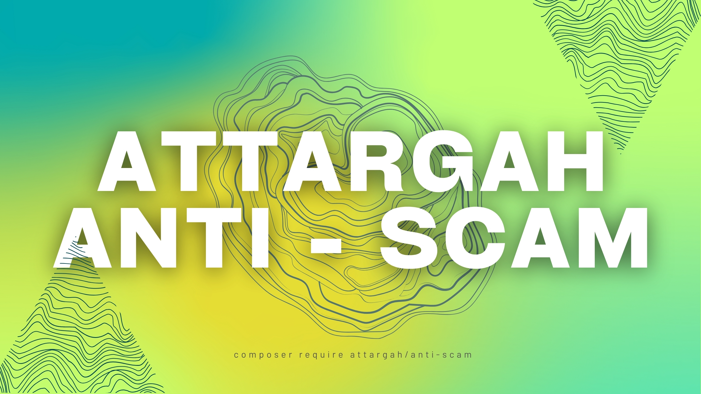

# Anti-Scam Laravel Package

A comprehensive Laravel package that provides advanced protection against spam, scam bots, and malicious activities on your web forms. This package integrates seamlessly with Filament admin panel for easy management and monitoring.

## Features

### 🛡️ Multi-Layer Protection
- **Anti-Scam Protection**: Detects and blocks scam bots using hidden form fields
- **Anti-Spam Protection**: Rate limiting with progressive ban duration
- **IP Blocking**: Temporary and permanent IP blocking system
- **XSS Protection**: Automatic input sanitization

### 📊 Admin Panel Integration
- **Filament Resources**: Manage blocked IPs, scam IPs, and logs
- **Real-time Monitoring**: Track blocked attempts and scam activities
- **Log Management**: Detailed logging with user agent, request details, and timestamps

### 🎯 Advanced Bot Detection
- **Hidden Form Fields**: Invisible honeypot fields to catch bots
- **Hash-based Validation**: Secure validation using Laravel's Hash facade
- **Randomized Input Order**: Prevents pattern-based bot detection
- **Configurable Display**: Hide fields using CSS or move them off-screen

## Installation

You can install the package via Composer:

```bash
composer require attargah/anti-scam
```

### Publish Configuration, Migrations and Translations

```bash
php artisan vendor:publish --tag="anti-scam-config"   

php artisan vendor:publish --tag="anti-scam-migrations"

php artisan vendor:publish --tag="anti-scam-translations"
```

### Run Migrations

```bash
php artisan migrate
```

### Configure the Package

Set your secret key in the `config/anti-scam.php` file:

```php
'key' => env('ANTI_SCAM_KEY', 'your-secret-key-here'),
```

## Configuration

The package provides extensive configuration options in `config/anti-scam.php`:

### Anti-Scam Configuration

```php
'scam' => [
    'active' => true,                    // Enable/disable scam protection
    'ban' => false,                      // Permanently ban scam IPs (not recommended)
    'save_log' => true,                  // Save scam attempts to database
    'register_logs_to_panel' => true,    // Show logs in admin panel
    'order_random' => true,              // Randomize input field order
    'display' => [
        'active' => false,               // Hide fields with CSS
        'css' => 'display:none!important',
    ],
    'off_screen' => [
        'active' => true,                // Move fields off-screen
        'css' => 'position:absolute!important; left:-9999px!important; z-index:-9999!important;',
    ],
],
```

### Anti-Spam Configuration

```php
'spam' => [
    'active' => true,                    // Enable/disable spam protection
    'max_requests_per_window' => 5,      // Max requests per time window
    'window_in_seconds' => 60,           // Time window length
    'ban_duration_multiplier' => 3,      // Progressive ban duration multiplier
    'permanent_ban_threshold_min' => 10080, // Permanent ban threshold (7 days)
],
```

## Usage

### 1. Protect Your Forms

Use the `@protect` Blade directive in your forms:

```blade
<form method="POST" action="/contact">
    @csrf
    @protect('contact-form')
    
    <input type="text" name="cf_name" placeholder="Your Name" required>
    <input type="email" name="cf_email" placeholder="Your Email" required>
    <textarea name=cf_"message" placeholder="Your Message" required></textarea>
    
    <button type="submit">Send Message</button>
</form>
```

### 2. Apply Middleware

Add the middleware to your routes or controllers:

```php
// In your routes file
Route::post('/contact', [ContactController::class, 'store'])
    ->middleware(['anti-scam', 'anti-spam', 'xss']);

// and in your bootstrap/app.php
return Application::configure(basePath: dirname(__DIR__))
    ->withRouting(
        web: __DIR__.'/../routes/web.php',
        commands: __DIR__.'/../routes/console.php',
        health: '/up',
    )
    ->withMiddleware(function (Middleware $middleware) {
        $middleware->append(\Attargah\AntiScam\Http\Middleware\CheckBlockedIP::class);
    })
    ->withExceptions(function (Exceptions $exceptions) {
        //
    })->create();

```
You can also prevent XSS attacks using Validation.
```php
$request->validate([
    'q' => ['required', new Xss],
]);

```
> 💡 **Bot Deception / Honeypot Success Message:**  
> To trick scam bots into thinking their request was successful, you can place the following snippet **before saving any data** in your controller:
>
> ```php
> if ($request->input('scam_status_'.config('key'))){
>     return back()->with('success', 'your_message'); // or any success return of your choice
> }
> ```
> This ensures that:
> - Legitimate users are not affected (since they won't trigger the hidden field).  
> - Bots see a success message and believe their request went through.  
> - No actual data is saved for requests flagged as scam.


### 3. Filament Admin Panel

Register the plugin in your Filament panel:

```php
use Attargah\AntiScam\AntiScamPlugin;

public function panel(Panel $panel): Panel
{
    return $panel
        ->plugins([
            AntiScamPlugin::make(),
        ]);
}
```

## Middleware Components

### AntiScam Middleware
- Detects scam bots using hidden form fields
- Validates hash-based tokens
- Logs scam attempts and optionally bans IPs

### AntiSpam Middleware
- Implements rate limiting with configurable thresholds
- Progressive ban duration (increases with repeated violations)
- Automatic permanent bans for persistent offenders

### CheckBlockedIP Middleware
- Blocks requests from banned IP addresses
- Supports both temporary and permanent bans
- Returns 403 status for blocked requests

### XSSProtection Middleware
- Sanitizes all input data
- Removes HTML tags and scripts
- Prevents XSS attacks

## Database Tables

The package creates three main tables:

- **`scam_ips`**: Stores detected scam IP addresses and related information
- **`blocked_ips`**: Manages IP blocking with expiration times
- **`blocked_ip_logs`**: Detailed logs of all blocking activities

## Testing

Run the test suite:

```bash
vendor/bin/pest .\vendor\attargah\anti-scam\tests
```

The package includes comprehensive tests for all middleware components and functionality.

## Security Considerations

1. **Secret Key**: Always use a strong, unique secret key for the anti-scam protection
2. **Rate Limiting**: Adjust spam protection settings based on your traffic patterns
3. **IP Blocking**: Be cautious with permanent IP bans as they may affect legitimate users
4. **Logging**: Regularly review logs to identify patterns and adjust protection levels

## Contributing

Contributions are welcome! Please feel free to submit a Pull Request.

## License

This package is open-sourced software licensed under the [MIT license](LICENSE.md).

## Support

If you encounter any issues or have questions, please open an issue on [GitHub](https://github.com/attargah/anti-scam/issues).

## Changelog

Please see [CHANGELOG](CHANGELOG.md) for more information on what has changed recently.

---

**Made with ❤️ by [Attargah](https://github.com/attargah)**
